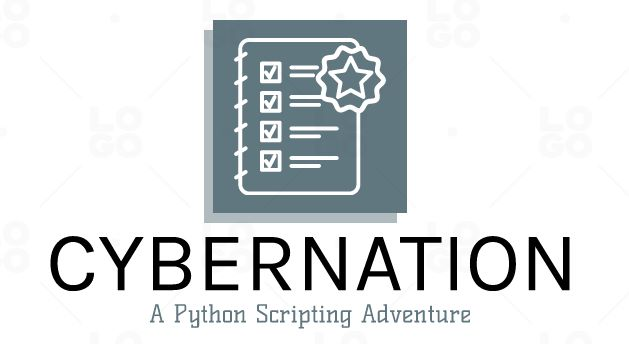

<div align="center">

    

  
  
  
 
</div>

<div style="display: inline_block">


# What is Cybernation?
Cybernation refers to control of an industrial operation or task through processing of information through a computer, refers to the use of software or scripts to automate the process of sending and receiving messages on the messaging platform. This can include things like sending messages to multiple contacts at once, scheduling messages to be sent at a later time. 


 ## 📝 Table of Content
  ```
  - Title and Cover Image
  - Project Description
  - Screenshots
  - Technology Used
  - Deployment
  - Feedback
  ```

## 📄 Project Description
## Advantages

```
- Save time and increase efficiency.
- Ability to personalize interactions with customers.
- Sending messages to a large number of people.
- Scheduling messages for future perspective.
```

## Disadvantages

```
- Loss of personal touch and human interaction ( customer interaction ).
- Need to keep the server on until the message has been sent.
```

 ## 📸 Screenshots
  ```
  ```
  
  ## 🛠 Stacks Used
 
  <div align="center">
  
  
  
 </div>
  
  
  ## 🚀 Deploy
                                                                                                                                      
   ### 📋 Prerequisites  
  To check your current Chrome Version type this in the chrome taskbar chrome://version/
  <br>
  To access and verify the specific ChromeDriver for running this Python script, please visit the following link: [ChromeDriver Download Page](http://chromedriver.storage.googleapis.com/index.html)

   ```
  - python@v3.8 or higher
  - git@2.40.1 or higher
  - pip@22.3.1 or higher
  ```                                                                                                                                   
                                                                                                                                      
  ### 🔧 How To Use                                                                                                                                  
  From your command line, first clone this repo:

```bash
# Clone this repository
$ git clone https://github.com/dummy-co-der/Cybernation.git
# Remove current origin repository
$ git remote remove origin
```

Then you can install the dependencies either using PIP:

Using PIP:

```bash
# Install dependencies
$ pip install
# Start development server
$ python -u {file location}
```
                                                                                                                          
                                                                                                                                      
## 🤝 Feedback
```
 - Suggestions are highly appreciated, whether it's regarding the format, content, or language used.
 - Email: maheshwarianuj1001@gmail.com or monaanjaliverma@gmail.com
```  
 

## Author Note
This script is meant to be informative. This repository's commercial use is absolutely forbidden. It is an independent third-party piece of software that has no connection to WhatsApp or any of its affiliates. Use at your own risk.
